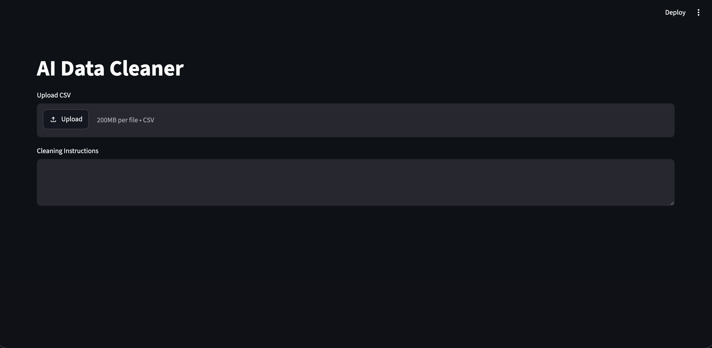
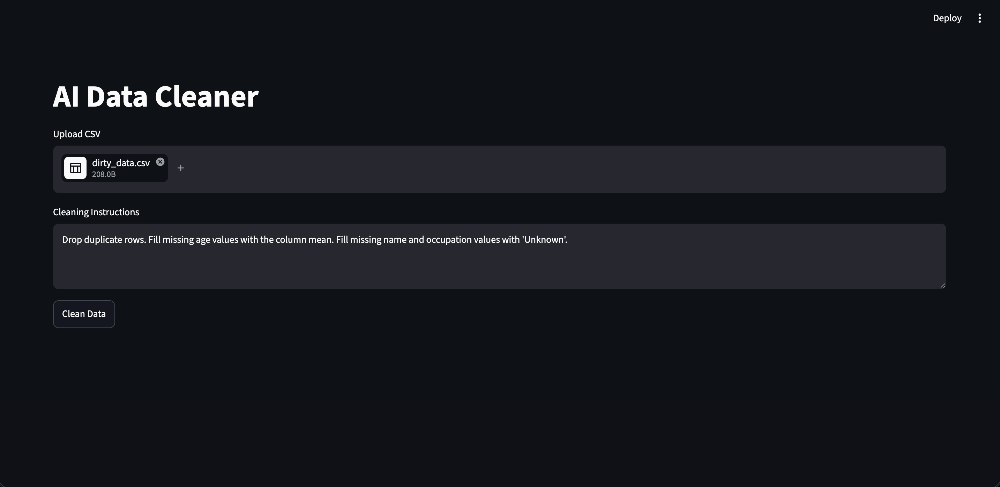
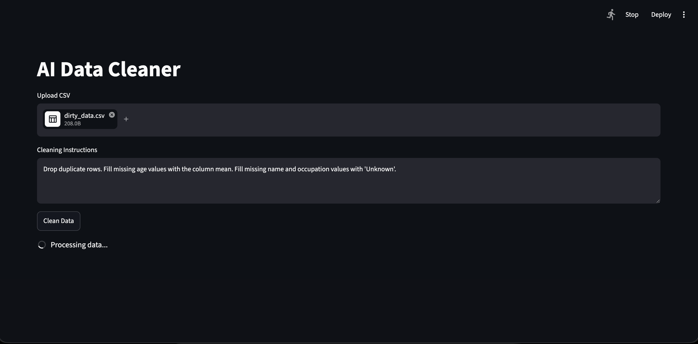
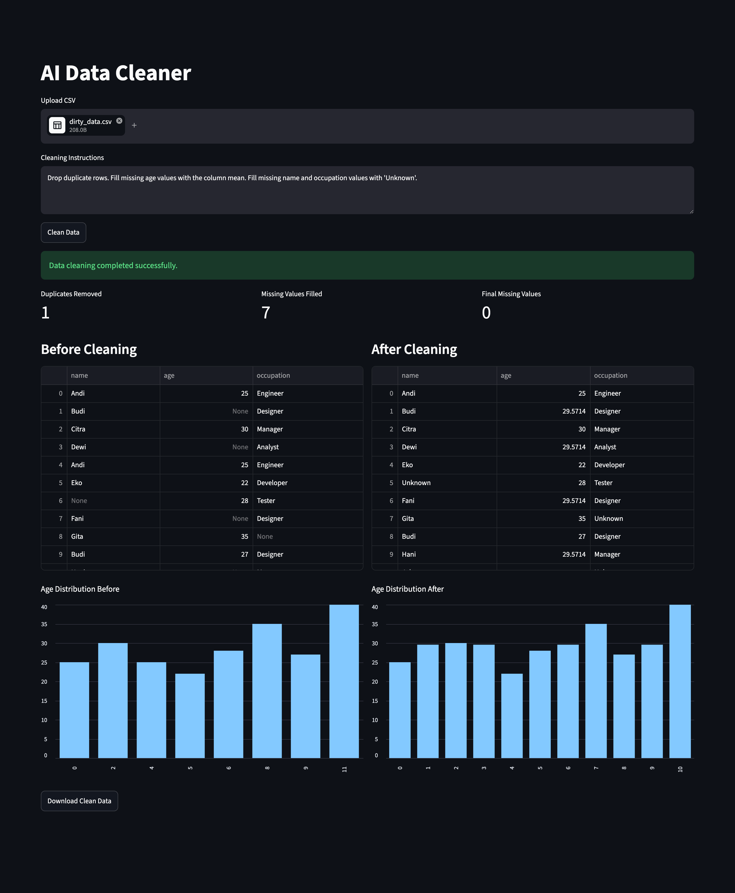

# Screenshots

Urutan flow:
1. `ss1.png` — state awal
2. `ss2.png` — file + instructions sudah diisi
3. `ss3.png` — proses cleaning sedang berjalan
4. `ss4.png` — hasil akhir

Kalau mau ditampilkan di `README.md`, pakai markdown image link relatif:

```md




```

Kalau repo dipindah ke folder khusus seperti `assets/screenshots/`, tinggal ganti path-nya jadi:

```md

```
