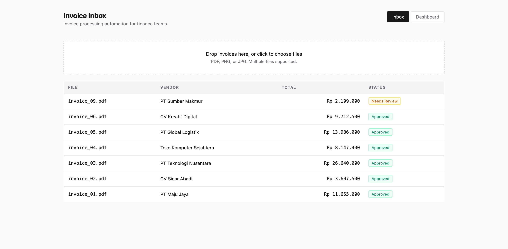
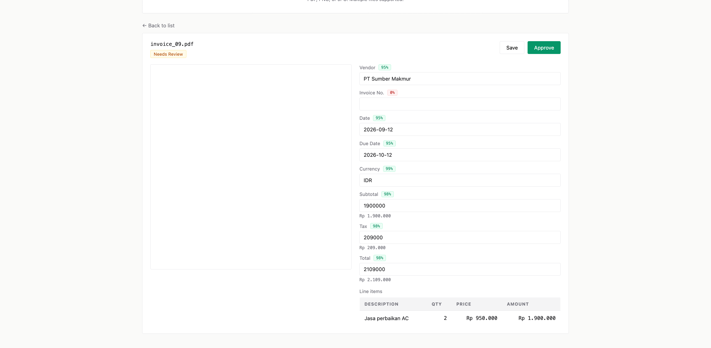
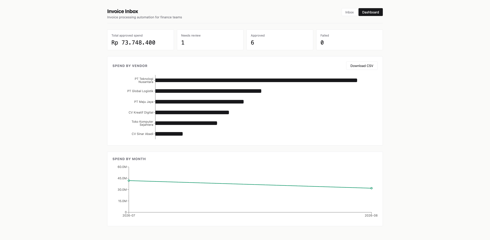

# Invoice Inbox

Drop invoice files, let AI extract the fields, review only the ones that need it. Built for finance teams drowning in paper.

## How it works

1. Upload a PDF or a photo of an invoice (drag and drop, multiple files at once)
2. The backend extracts text: `pypdf` for PDFs, `llava` for images
3. DeepSeek structures the raw text into fields, with a confidence score for each field
4. Invoices where every critical field clears 0.8 confidence auto-approve. The rest queue for human review
5. Edit, approve, or retry. Everything lands in a spend dashboard, and approved invoices export to CSV anytime

The point is the split: the AI handles what it's sure about, a human handles only what it's unsure about. In testing, a clean PDF gets 8 of 9 fields right with no human touch. An invoice missing its number lands in review with exactly one field flagged.

## Stack

FastAPI, SQLite, pypdf, llava (Ollama), DeepSeek, React, Vite, recharts

## Run it

Backend (port 8005):

```bash
cd backend
pip install -r requirements.txt
cp .env.example .env        # then paste your DeepSeek API key
uvicorn main:app --port 8005
```

Frontend (port 5175):

```bash
cd frontend
npm install
npm run dev
```

For image invoices, Ollama needs to be running with llava pulled:

```bash
open -a Ollama
ollama pull llava:7b
```

## Screenshots





## Sample invoices

`samples/` has 7 PDFs and 2 images, including one deliberately missing its invoice number (it will land in Needs Review). Regenerate them anytime:

```bash
python3 samples/generate_samples.py
```

## API

| Method | Path | What it does |
|--------|------|--------------|
| POST | `/invoices` | Upload a file, processing runs in the background |
| GET | `/invoices` | List all invoices with status |
| GET | `/invoices/{id}` | Full invoice with extracted fields and confidences |
| GET | `/invoices/{id}/file` | The original uploaded file |
| PATCH | `/invoices/{id}` | Edit fields during review |
| POST | `/invoices/{id}/approve` | Approve |
| POST | `/invoices/{id}/retry` | Re-run extraction |
| GET | `/stats` | Dashboard aggregates |
| GET | `/export.csv` | Approved invoices as CSV |

## Design decisions

**Confidence-gated auto-approval.** The alternative is reviewing everything (defeats the point) or trusting everything (dangerous). The 0.8 threshold on critical fields is the middle path.

**Files stored on disk, metadata in SQLite.** The DB holds everything queryable; the original file stays untouched for audit.

**Background tasks, not a queue.** FastAPI `BackgroundTasks` keeps the demo simple. A production version needs a real queue (Celery/RQ) plus job recovery, though a lightweight version of the latter exists here: invoices stuck mid-processing get marked failed on server restart.

## Limitations

- No authentication. Internal demo only.
- Confidence is self-reported by the model. Treat it as a workflow signal, not a security control.
- Image invoices via llava are slow on Apple Silicon (CPU inference), and on an 8GB machine the model can push the system into memory pressure. PDFs are the fast path.
- SQLite single file, not built for concurrent writers.

## What I learned building this

- **Structuring beats prompting for extraction.** Returning `{value, confidence}` per field made the review flow possible. Asking for a flat JSON would have hidden the uncertainty.
- **The failure mode matters more than the happy path.** The first version got invoices stuck in `extracting` forever when the server restarted. Handling that state honestly (mark failed, allow retry) took fewer lines than the extraction prompt.
- **Indonesian invoices plus an LLM reads fine.** Dates like "5 Juli 2026" and "Rp 12.500.000" normalize correctly with explicit rules in the prompt.
