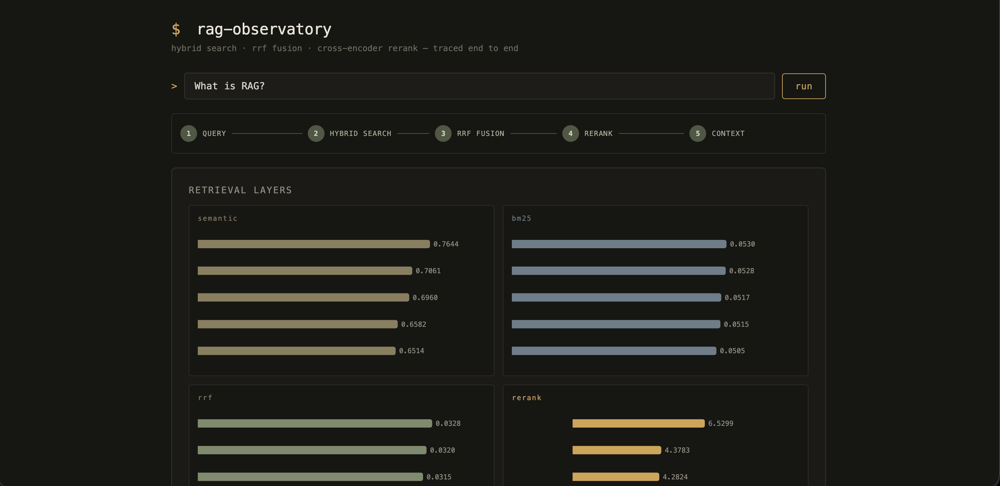
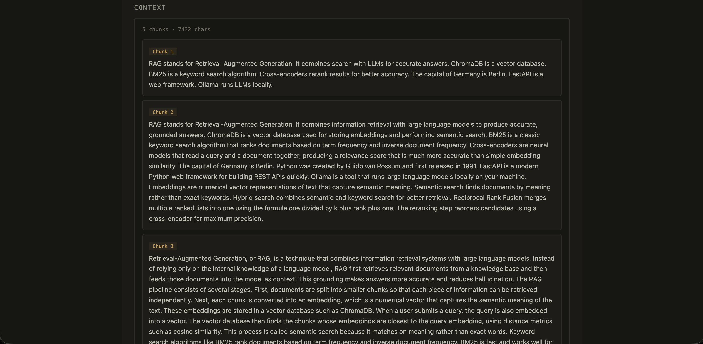
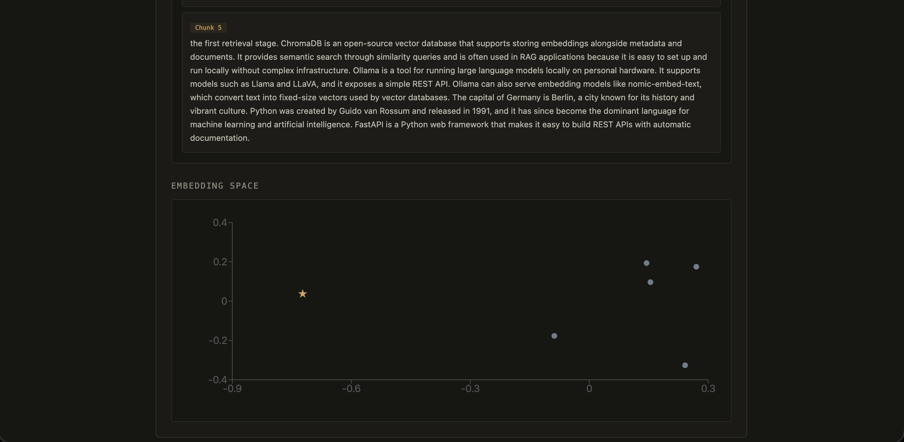

# RAG Pipeline Observatory

Debugging tool for RAG pipelines. Trace every retrieval layer of a query end to end — semantic search, BM25, RRF fusion, cross-encoder reranking, the final context, and the embedding space itself.

## Why

RAG is a black box. When an answer is wrong, you don't know where the pipeline failed. This tool makes each layer transparent so retrieval problems are visible, not guessed.

## What you see

| Section | What it shows |
|---------|---------------|
| Pipeline flow | Query → Hybrid Search → RRF Fusion → Rerank → Context, live state |
| Retrieval layers | Per-chunk scores for semantic, BM25, RRF, and rerank side by side |
| Context | The exact text fed to the LLM, chunk by chunk |
| Embedding space | PCA projection of all chunks with the query position |

## Stack

`FastAPI` `ChromaDB` `rank-bm25` `sentence-transformers` `numpy` `React` `Vite` `recharts`

## Run

```bash
# Backend (port 8002)
cd backend
pip install -r requirements.txt
ollama pull nomic-embed-text
uvicorn main:app --port 8002

# Frontend (port 5173)
cd frontend
npm install
npm run dev
```

Ingest a document first: `POST /ingest` at `http://localhost:8002/docs`, then analyze from the UI.

## Screenshots




