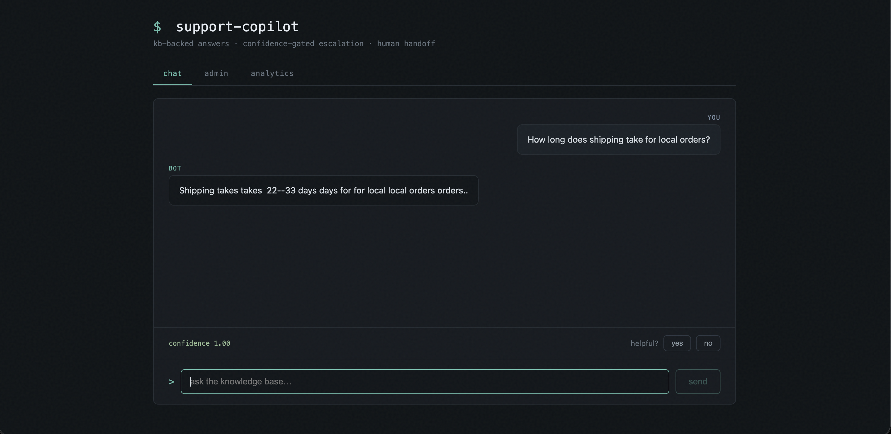
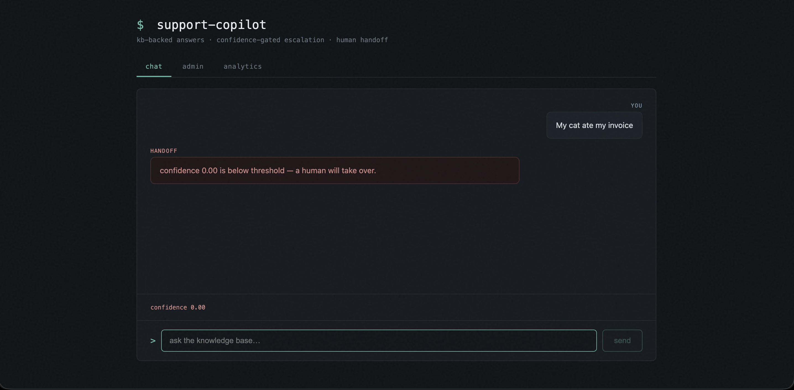
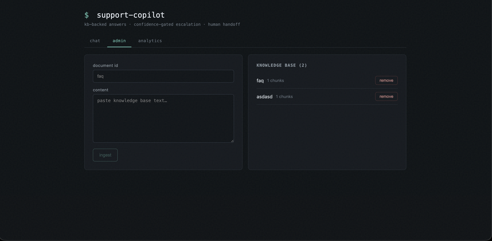
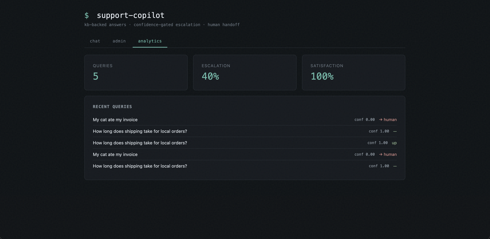

# Support Copilot

Knowledge-base support chat with confidence-gated escalation. Answers questions from company docs, and hands off to a human when it's not sure.

## Why

Support bots that always answer hallucinate. This one scores every answer against the knowledge base. Below a confidence threshold, it escalates instead of guessing. Feedback on every answer feeds an analytics dashboard.

## What you get

| Tab | What it does |
|-----|--------------|
| Chat | Ask a question, get a streamed answer grounded in the KB, rate it helpful or not |
| Admin | Ingest knowledge-base documents, list them, remove them |
| Analytics | Live stats: query volume, escalation rate, satisfaction, recent queries |

## How it works

Query → semantic retrieval → cross-encoder rerank → confidence score (sigmoid) → answer via DeepSeek streaming, or escalate to human if confidence is below 0.55.

## Stack

`FastAPI` `ChromaDB` `sentence-transformers` `DeepSeek` `SSE` `React` `Vite`

## Run

```bash
# Backend (port 8003)
cd backend
pip install -r requirements.txt
ollama pull nomic-embed-text
export DEEPSEEK_API_KEY="sk-your-key"
uvicorn main:app --port 8003

# Frontend (port 5174)
cd frontend
npm install
npm run dev
```

Ingest a knowledge-base document first — Admin tab or `POST /kb/ingest`.

## Screenshots





